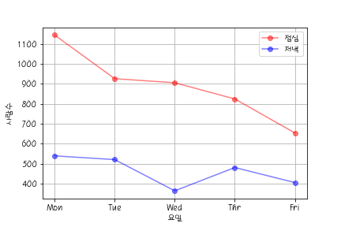

# DACON data visualization

- Site: [구내식당 식수 인원 예측 AI 경진대회](https://dacon.io/competitions/official/235743/overview/description)

- Date: 2021.06.23 - 2021.06.24

## 일자별 점심계와 석식계 분석

## 요일별 점심계와 석식계 분석

## 중식계, 석식계 빈도수

## 워드클라우드 점심 메뉴

## 상관계수를 이용한 히트맵

